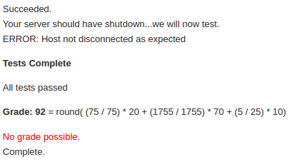

# TCP Chat Server
This repository contains my implementation of a multi-chatroom capable chatroom. I initially attempted to write it in Haskell (see [Haskell branch](https://github.com/stefano-lupo/TCP-Chat-Server/tree/Haskell)), however due to time constraints I had to switch back to Java in order to get it fully functional. 

The server can be ran with the following scripts (ensure they have executable permissions):
- Compile: `./compile.sh`
- Run: `./start.sh <port>`

The server passed all of the tests that were offered by the online testing system. 
However the test for shutting the server down using the `KILL_SERVICE` command failed but I am not sure why as the server does successfully shut down upon receiving that command. Thus the overall score I received was 92.

